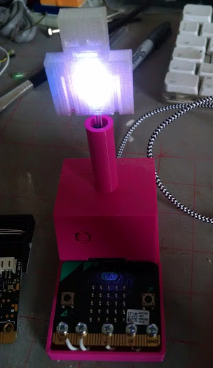

## Thoughts on the Desktop

### Saturday 23rd June, Neuromuscular Centre, Winsford

Make files, code and documentation for the **Thoughts on the Desktop** project an introduction to 3D prototyping for the Neuromuscular Centre's co-working space and design services.

Inspired by artist and educator [Neil Winterburn](https://twitter.com/OnThePennines)’s [howtoseethoughts](http://howtoseethoughts.org) project, [Neuromuscular Centre](http://www.nmcentre.com/) user, artist and researcher Ross Dalziel will be working with other members of the NMC’s community to 3D print and demonstrate interactive objects made with [beetleblocks](http://beetleblocks.com) software and [microbit](http://microbit.co.uk) & an [Ultimaker](http://ultimaker.com)printer borrowed from [DoESLiverpool](http://doesliverpool.com) to represent thoughts and feelings for the desktops of people using the NMC co-working space.

